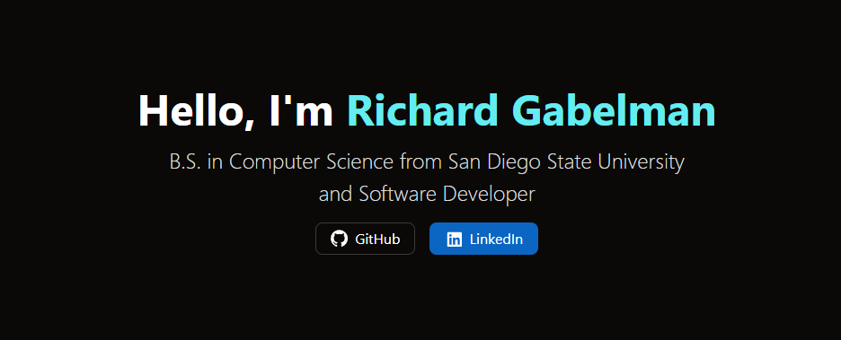

<a id="readme-top"></a>

<!-- PROJECT SHIELDS -->
<!--
*** I'm using markdown "reference style" links for readability.
*** Reference links are enclosed in brackets [ ] instead of parentheses ( ).
*** See the bottom of this document for the declaration of the reference variables
*** for contributors-url, forks-url, etc. This is an optional, concise syntax you may use.
*** https://www.markdownguide.org/basic-syntax/#reference-style-links
-->
[![Contributors][contributors-shield]][contributors-url]
[![Forks][forks-shield]][forks-url]
[![Stargazers][stars-shield]][stars-url]
[![Issues][issues-shield]][issues-url]
[![GPL-3.0 License][license-shield]][license-url]
[![LinkedIn][linkedin-shield]][linkedin-url]


<!-- PROJECT LOGO -->
<br />
<div align="center">
  <a href="https://github.com/RichardGabelman/portfolio">
    
  </a>

<h3 align="center">Portfolio</h3>

  <p align="center">
    Personal portfolio website built with React and CSS. Features project showcases with links to live demos and source code.
    <br />
    <br />
    <br />
    <a href="https://richard-gabelman.vercel.app">View Live</a>
    &middot;
    <a href="https://github.com/RichardGabelman/portfolio/issues/new?labels=bug&template=bug-report---.md">Report Bug</a>
  </p>
</div>


<!-- TABLE OF CONTENTS -->
<details>
  <summary>Table of Contents</summary>
  <ol>
    <li>
      <a href="#about-the-project">About The Project</a>
      <ul>
        <li><a href="#built-with">Built With</a></li>
      </ul>
    </li>
    <li>
      <a href="#getting-started">Getting Started</a>
      <ul>
        <li><a href="#prerequisites">Prerequisites</a></li>
        <li><a href="#installation">Installation</a></li>
      </ul>
    </li>
    <li><a href="#license">License</a></li>
    <li><a href="#contact">Contact</a></li>
  </ol>
</details>


<!-- ABOUT THE PROJECT -->
## About The Project

[](images/hero_screenshot.png)


<p align="right">(<a href="#readme-top">back to top</a>)</p>


### Built With

* [![Vite][Vite.js]][Vite-url]
* [![React][React.js]][React-url]

<p align="right">(<a href="#readme-top">back to top</a>)</p>


<!-- GETTING STARTED -->
## Getting Started

To get a local copy up and running, follow these simple steps.

### Prerequisites

* Node.js and npm installed on your machine

### Installation

1. Clone the repo
```sh
   git clone https://github.com/RichardGabelman/portfolio.git
```
2. Navigate to the project directory
```sh
   cd portfolio
```
3. Install dependencies
```sh
   npm install
```
4. Start the development server
```sh
   npm run dev
```
5. Open your browser and visit `http://localhost:5173`

<p align="right">(<a href="#readme-top">back to top</a>)</p>

<!-- LICENSE -->
## License

Distributed under the GPL-3.0 License. See `LICENSE` for more information.

<p align="right">(<a href="#readme-top">back to top</a>)</p>


<!-- CONTACT -->
## Contact

Richard Gabelman - [@RichardGabelman](https://twitter.com/RichardGabelman) - richardgabelman@gmail.com

Project Link: [https://github.com/RichardGabelman/portfolio](https://github.com/RichardGabelman/portfolio)

<p align="right">(<a href="#readme-top">back to top</a>)</p>

<!-- MARKDOWN LINKS & IMAGES -->
<!-- https://www.markdownguide.org/basic-syntax/#reference-style-links -->
[contributors-shield]: https://img.shields.io/github/contributors/RichardGabelman/portfolio.svg?style=for-the-badge
[contributors-url]: https://github.com/RichardGabelman/portfolio/graphs/contributors
[forks-shield]: https://img.shields.io/github/forks/RichardGabelman/portfolio.svg?style=for-the-badge
[forks-url]: https://github.com/RichardGabelman/portfolio/network/members
[stars-shield]: https://img.shields.io/github/stars/RichardGabelman/portfolio.svg?style=for-the-badge
[stars-url]: https://github.com/RichardGabelman/portfolio/stargazers
[issues-shield]: https://img.shields.io/github/issues/RichardGabelman/portfolio.svg?style=for-the-badge
[issues-url]: https://github.com/RichardGabelman/portfolio/issues
[license-shield]: https://img.shields.io/github/license/RichardGabelman/portfolio.svg?style=for-the-badge
[license-url]: https://github.com/RichardGabelman/portfolio/blob/main/LICENSE
[linkedin-shield]: https://img.shields.io/badge/-LinkedIn-black.svg?style=for-the-badge&logo=linkedin&colorB=555
[linkedin-url]: https://linkedin.com/in/richard-gabelman
[product-screenshot]: images/screenshot.png
[Vite.js]: https://img.shields.io/badge/Vite-646CFF?logo=vite&logoColor=fff
[Vite-url]: https://vite.dev
[React.js]: https://img.shields.io/badge/React-%2320232a.svg?logo=react&logoColor=%2361DAFB
[React-url]: https://reactjs.org/
